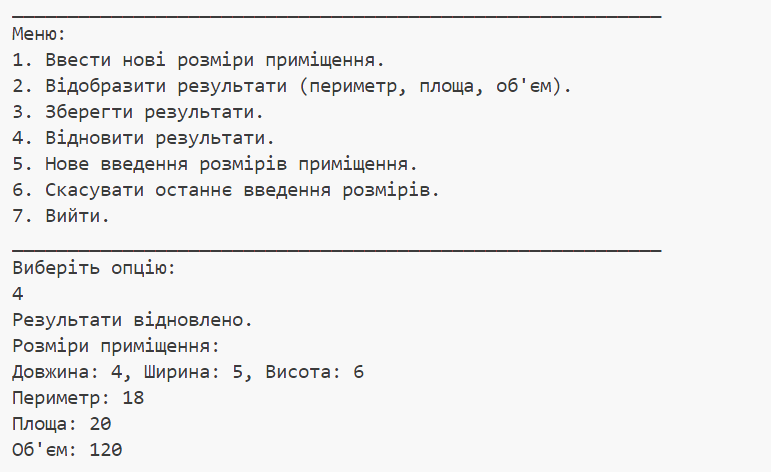

# OOP

**Варіант №7: Визначити периметр, площу та об'єм приміщення за заданими двійковими
значеннями довжини, ширини та висоти.**

# **Завдння 1**

**1.1) Підготувати сховище до розміщення проекту:**


**1.2) Написати просту консольну програму:**

**Код Hello:**
````java
package ex01;


public class Hello {
    public static void main(String[] args) {
        System.out.println("Hello !!!");
    }
}
````
**Фото роботи програми:**


# **Завдання 2**

**2.1) Розробити клас, що серіалізується, для зберігання параметрів і результатів обчислень.
Використовуючи агрегування, розробити клас для знаходження рішення задачі.**

**Код RoomParams:**
````java
package ex02;


import java.io.Serializable;

/**
 * Клас для зберігання параметрів приміщення.
 */
public class RoomParams implements Serializable {
    private static final long serialVersionUID = 1L;

    private double length;
    private double width;
    private double height;

    public RoomParams(double length, double width, double height) {
        this.length = length;
        this.width = width;
        this.height = height;
    }

    public double getLength() {
        return length;
    }

    public double getWidth() {
        return width;
    }

    public double getHeight() {
        return height;
    }

    @Override
    public String toString() {
        return "Length: " + length + ", Width: " + width + ", Height: " + height;
    }
}
````


**2.2) Розробити клас для демонстрації в діалоговому режимі збереження та відновлення стану об'єкта, використовуючи серіалізацію. Показати особливості використання transient полів.**

**Код RoomCalculator:**
````java
package ex02;


import java.io.IOException;
import java.io.ObjectInputStream;
import java.io.ObjectOutputStream;
import java.io.Serializable;

/**
 * Клас для обчислення периметру, площі та об'єму приміщення на основі параметрів.
 */
public class RoomCalculator implements Serializable {
    private static final long serialVersionUID = 1L;

    private transient RoomParams params; // transient поле, не серіалізується

    public RoomCalculator(double length, double width, double height) {
        this.params = new RoomParams(length, width, height);
    }

    public double getPerimeter() {
        return 2 * (params.getLength() + params.getWidth());
    }

    public double getArea() {
        return params.getLength() * params.getWidth();
    }

    public double getVolume() {
        return params.getLength() * params.getWidth() * params.getHeight();
    }

    private void writeObject(ObjectOutputStream out) throws IOException {
        out.defaultWriteObject();
        out.writeDouble(params.getLength());
        out.writeDouble(params.getWidth());
        out.writeDouble(params.getHeight());
    }

    private void readObject(ObjectInputStream in) throws IOException, ClassNotFoundException {
        in.defaultReadObject();
        double length = in.readDouble();
        double width = in.readDouble();
        double height = in.readDouble();
        this.params = new RoomParams(length, width, height);
    }
}
````


**Код RoomDemo:**
````java
package ex02;

import java.io.BufferedReader;
import java.io.IOException;
import java.io.InputStreamReader;

/**
 * Клас для демонстрації взаємодії з користувачем та використання серіалізації для збереження та відновлення стану об'єкта.
 */
public class RoomDemo {
    public static void main(String[] args) throws IOException, ClassNotFoundException {
        BufferedReader reader = new BufferedReader(new InputStreamReader(System.in));
        double length, width, height;

        // Введення параметрів приміщення
        System.out.println("Введіть довжину:");
        length = Double.parseDouble(reader.readLine());

        System.out.println("Введіть ширину:");
        width = Double.parseDouble(reader.readLine());

        System.out.println("Введіть висоту:");
        height = Double.parseDouble(reader.readLine());

        // Створення об'єкта RoomCalculator з введеними параметрами
        RoomCalculator calculator = new RoomCalculator(length, width, height);

        // Виведення результатів
        System.out.println("Периметр: " + calculator.getPerimeter());
        System.out.println("Площа: " + calculator.getArea());
        System.out.println("Об'єм: " + calculator.getVolume());
    }
}
````

**Фото роботи програми:**


**2.3) Розробити клас для тестування коректності результатів обчислень та серіалізації/десеріалізації. Використовувати докладні коментарі для автоматичної генерації документації засобами javadoc.**

**Код RoomTester:**
````java
package ex02;

import java.io.IOException;
import java.io.ObjectInputStream;
import java.io.ObjectOutputStream;
import java.io.Serializable;

public class RoomTester implements Serializable {
    private static final long serialVersionUID = 1L;

    public static double testPerimeter(double length, double width) {
        RoomCalculator calculator = new RoomCalculator(length, width, 0.0);
        return calculator.getPerimeter();
    }

    public static double testArea(double length, double width) {
        RoomCalculator calculator = new RoomCalculator(length, width, 0.0);
        return calculator.getArea();
    }

    public static double testVolume(double length, double width, double height) {
        RoomCalculator calculator = new RoomCalculator(length, width, height);
        return calculator.getVolume();
    }

    public static RoomCalculator testSerialization(double length, double width, double height) {
        RoomCalculator calculator = new RoomCalculator(length, width, height);
        RoomCalculator deserializedCalculator = null;

        try {
            // Serialization
            ObjectOutputStream out = new ObjectOutputStream(System.out);
            out.writeObject(calculator);
            out.close();

            // Deserialization
            ObjectInputStream in = new ObjectInputStream(System.in);
            deserializedCalculator = (RoomCalculator) in.readObject();
            in.close();
        } catch (IOException | ClassNotFoundException e) {
            e.printStackTrace();
        }

        return deserializedCalculator;
    }
}
````


**Код RoomTesterDemo:**
````java
package ex02;

import java.io.BufferedReader;
import java.io.IOException;
import java.io.InputStreamReader;

/**
 * Клас для демонстрації взаємодії з користувачем та використання методів тестування.
 */
public class RoomTesterDemo {
    public static void main(String[] args) throws IOException {
        BufferedReader reader = new BufferedReader(new InputStreamReader(System.in));
        double length, width, height;

        // Введення параметрів приміщення
        System.out.println("Введіть довжину:");
        length = Double.parseDouble(reader.readLine());

        System.out.println("Введіть ширину:");
        width = Double.parseDouble(reader.readLine());

        System.out.println("Введіть висоту:");
        height = Double.parseDouble(reader.readLine());

        // Виклик методів тестування
        double perimeter = RoomTester.testPerimeter(length, width);
        double area = RoomTester.testArea(length, width);
        double volume = RoomTester.testVolume(length, width, height);

        System.out.println("Результати тестування:");
        System.out.println("Периметр: " + perimeter);
        System.out.println("Площа: " + area);
        System.out.println("Об'єм: " + volume);
    }
}
````

**Фото роботи програми:**


# **Завдння 3**

**3.1) Як основа використовувати вихідний текст проекту попередньої лабораторної роботи. Забезпечити розміщення результатів обчислень уколекції з можливістю збереження/відновлення.**

**3.2) Використовуючи шаблон проектування Factory Method (Virtual Constructor), розробити ієрархію, що передбачає розширення рахунок додавання нових відображуваних класів.**

**3.3) Розширити ієрархію інтерфейсом "фабрикованих" об'єктів, що представляє набір методів для відображення результатів обчислень.**

**3.4) Реалізувати ці методи виведення результатів у текстовому виде.**

**3.5) Розробити тареалізувати інтерфейс для "фабрикуючого" методу.**


**Код CalculationResult:**
````java
package ex03;

import java.io.*;

/**
 * Клас, який представляє результати обчислень і є серіалізованим.
 * Зберігає параметри та результати обчислень, а саме висоту, ширину та довжину приміщення,
 * а також обчислює площу, периметр та об'єм приміщення.
 */
public class CalculationResult implements Serializable {
    private static final long serialVersionUID = 1L;
    private int height;
    private int width;
    private int length;
    private int area;
    private int perimeter;
    private int volume;

    public CalculationResult(int height, int width, int length) {
        this.height = height;
        this.width = width;
        this.length = length;
        calculateArea();
        calculatePerimeter();
        calculateVolume();
    }

    private void calculateArea() {
        area = length * width;
    }

    private void calculatePerimeter() {
        perimeter = 2 * (length + width);
    }

    private void calculateVolume() {
        volume = length * width * height;
    }

    public void saveToFile(String fileName) throws IOException {
        try (ObjectOutputStream out = new ObjectOutputStream(new FileOutputStream(fileName))) {
            out.writeObject(this);
            System.out.println("Результати обчислень збережено у файл " + fileName);
        }
    }

    public static CalculationResult restoreFromFile(String fileName) throws IOException, ClassNotFoundException {
        try (ObjectInputStream in = new ObjectInputStream(new FileInputStream(fileName))) {
            return (CalculationResult) in.readObject();
        }
    }

    @Override
    public String toString() {
        return "Висота: " + height + ", Ширина: " + width + ", Довжина: " + length +
               "\nПлоща: " + area + ", Периметр: " + perimeter + ", Об'єм: " + volume;
    }
}
````


**Код ViewResult:**
````java
package ex03;


public class ViewResult implements View {
    
    private int perimeter;
    private int area;
    private int volume;
    
    // Конструктор та інші методи класу
    
    @Override
    public void viewHeader() {
        System.out.println("=== Результати обчислень ===");
    }
    
    @Override
    public void viewBody() {
        System.out.printf("Периметр: %d%n", perimeter);
        System.out.printf("Площа: %d%n", area);
        System.out.printf("Об'єм: %d%n", volume);
    }
    
    @Override
    public void viewFooter() {
        System.out.println("=== Кінець результатів ===");
    }
    
    @Override
    public void viewShow() {
        viewHeader();
        viewBody();
        viewFooter();
    }
}
````


**Код ViewableResult:**
````java
package ex03;


public class ViewableResult implements Viewable {
    @Override
    public ViewResult getView() {
        return new ViewResult();
    }
}
````


**Код Main:**
````java
package ex03;

import java.io.*;
import java.util.Scanner;

/**
 * Клас для демонстрації в діалоговому режимі збереження та відновлення стану об'єкта серіалізації/десеріалізації
 */
public class Main {
    public static void main(String[] args) {
        Scanner scanner = new Scanner(System.in);

        System.out.print("Введіть висоту приміщення: ");
        int height = scanner.nextInt();

        System.out.print("Введіть ширину приміщення: ");
        int width = scanner.nextInt();

        System.out.print("Введіть довжину приміщення: ");
        int length = scanner.nextInt();

        // Створюємо об'єкт класу CalculationResult
        CalculationResult result = new CalculationResult(height, width, length);

        // Створюємо об'єкт класу ViewableResult
        ViewableResult viewableResult = new ViewableResult();

        // Отримуємо об'єкт класу View за допомогою методу getView
        View view = viewableResult.getView();

        // Викликаємо метод viewShow для відображення результатів
        view.viewShow();

        try {
            // Зберігаємо результати обчислень
            result.saveToFile("calculation_result.ser");

            // Відновлюємо результати обчислень з файлу
            CalculationResult restoredResult = CalculationResult.restoreFromFile("calculation_result.ser");
            System.out.println("Відновлені результати: " + restoredResult);
        } catch (IOException | ClassNotFoundException e) {
            e.printStackTrace();
        }

        scanner.close();
    }
}
````


**Код TextView:**
````java
package ex03;

/**
 * Клас `TextView` реалізує інтерфейс `View` для відображення результатів обчислень у текстовому форматі.
 */
public class TextView implements View {
    @Override
    public void viewHeader() {
        System.out.println("Тут починається відображення результатів:");
    }

    @Override
    public void viewBody() {
        // Логіка для відображення тіла результатів
    }

    @Override
    public void viewFooter() {
        System.out.println("Тут закінчується відображення результатів.");
    }

    @Override
    public void viewShow() {
        viewHeader();
        viewBody();
        viewFooter();
    }
}
````


**Код View:**
````java
package ex03;

/**
 * Інтерфейс, який визначає методи для відображення результатів обчислень.
 */
public interface View {
    void viewShow();
    void viewHeader();
    void viewBody();
    void viewFooter();
}
````


**Код Viewable:**
````java
package ex03;

import java.io.IOException;

/**
 * Інтерфейс для фабрикуючого методу, що визначає метод для отримання об'єкта для відображення результатів обчислень.
 */
public interface Viewable {
    View getView();
}
````
**Фото роботи програми:**


# **Завдння 4**

**4.1) За основу використовувати вихідний текст проекту попередньої лабораторної роботи Використовуючи шаблон проектування Factory Method (Virtual Constructor), розширити ієрархію похідними класами, реалізують методи для подання результатів у вигляді текстової таблиці. Параметри відображення таблиці мають визначатися користувачем.**

**4.2) Продемонструвати заміщення (перевизначення, overriding), поєднання (перевантаження, overloading), динамічне призначення методів (Пізнє зв'язування, поліморфізм, dynamic method dispatch).**

**4.3) Забезпечити діалоговий інтерфейс із користувачем.**

**4.4) Розробити клас для тестування основної функціональності.**

**4.5) Використати коментарі для автоматичної генерації документації засобами javadoc.**


**Код Main:**
````java
package ex04;

import java.util.Scanner;

/**
 * Клас `Main` для демонстрації роботи програми.
 */
public class Main {
    /**
     * Головний метод програми.
     * @param args аргументи командного рядка
     */
    public static void main(String[] args) {
        ViewableResult viewableResult = new ViewableResult();
        View view = viewableResult.getView();
        view.viewShow();
    }
}
````


**Код View:**
````java
package ex04;

/**
 * Інтерфейс, який оголошує методи для відображення заголовку, тіла, підзаголовку та всіх елементів.
 */
public interface View {
    /**
     * Метод для відображення заголовку.
     */
    void viewHeader();
    
    /**
     * Метод для відображення тіла.
     */
    void viewBody();
    
    /**
     * Метод для відображення підзаголовку.
     */
    void viewFooter();
    
    /**
     * Метод для відображення всіх елементів.
     */
    void viewShow();
}
````


**Код Viewable:**
````java
package ex04;

/**
 * Інтерфейс, який визначає метод getView(), який повинен бути реалізований у класах,
 * що реалізують цей інтерфейс. Метод getView() повертає об'єкт класу View.
 */
public interface Viewable {
    /**
     * Метод, який повертає об'єкт класу View.
     *
     * @return об'єкт класу View
     */
    View getView();
}
````


**Код ViewableResult:**
````java
package ex04;

/**
 * Конкретний створювач (Concrete Creator) у шаблоні проектування Factory Method.
 * Реалізує інтерфейс Viewable, надаючи метод getView(), який повертає новий об'єкт ViewCalculator.
 */
public class ViewableResult implements Viewable {
    /**
     * Метод, який повертає новий об'єкт класу ViewCalculator.
     *
     * @return новий об'єкт класу ViewCalculator
     */
    @Override
    public View getView() {
        return new ViewCalculator();
    }
}
````


**Код MainTest:**
````java
package ex04;

/**
 * Клас для тестування основної функціональності.
 */
public class MainTest {
    /**
     * Функція протестована.
     */
    private static boolean tested = true;
    
    public static void main(String[] args) {
        // Створюємо об'єкт класу ViewableResult
        ViewableResult viewableResult = new ViewableResult();
        
        // Отримуємо об'єкт класу View за допомогою методу getView
        View view = viewableResult.getView();
        
        // Викликаємо метод viewShow для відображення результатів
        view.viewShow();
        
        if(tested) {
            System.out.println("Функція протестована!");
        }
    }
}
````


**Код ViewCalculator:**
````java
package ex04;

import java.util.Scanner;

/**
 * Клас, який представляє результати обчислень та забезпечує їх відображення.
 * Реалізує інтерфейс View для обчислення та відображення периметру, площі та об'єму приміщення за заданими параметрами.
 */
public class ViewCalculator implements View {
    private int length;
    private int width;
    private int height;
    private int perimeter;
    private int area;
    private int volume;
    
    /**
     * Конструктор класу, який отримує від користувача вхідні дані та обчислює периметр, площу та об'єм.
     */
    public ViewCalculator() {
        Scanner scanner = new Scanner(System.in);

        System.out.print("Введіть довжину приміщення: ");
        this.length = scanner.nextInt();

        System.out.print("Введіть ширину приміщення: ");
        this.width = scanner.nextInt();

        System.out.print("Введіть висоту приміщення: ");
        this.height = scanner.nextInt();

        scanner.close();

        calculate();
    }
    
    /**
     * Метод для обчислення периметру, площі та об'єму приміщення.
     */
    private void calculate() {
        this.perimeter = 2 * (length + width);
        this.area = length * width;
        this.volume = length * width * height;
    }
    
    @Override
    public void viewHeader() {
        System.out.println();
        System.out.println(" ┌────────────┬──────────────┬───────────────┐");
        System.out.println(" │ Периметр   │ Площа        │ Об'єм         │");
        System.out.println(" ├────────────┼──────────────┼───────────────┤");
    }

    @Override
    public void viewBody() {
        System.out.printf(" │ %10d │ %12d │ %13d │%n", perimeter, area, volume);
    }

    @Override
    public void viewFooter() {
        System.out.println(" └────────────┴──────────────┴───────────────┘");
    }

    @Override
    public void viewShow() {
        viewHeader();
        viewBody();
        viewFooter();
    }
}
````

**Фото роботи програми:**


**Фото роботи програми:**


# **Завдння 5**

**5.1) Реалізувати можливість скасування (undo) операцій (команд).**

**5.2) Продемонструвати поняття "макрокоманда".**

**5.3) При розробці програми використовувати шаблон Singletone.**

**5.4) Забезпечити діалоговий інтерфейс із користувачем.**

**5.5) Розробити клас для тестування функціональності програми.**


**Код RoomCalculation:**
````java
package ex05;


import java.io.*;

public class RoomCalculation {
    public int calculatePerimeter(int length, int width) {
        return 2 * (length + width);
    }

    public int calculateArea(int length, int width) {
        return length * width;
    }

    public int calculateVolume(int length, int width, int height) {
        return length * width * height;
    }
}
````


**Код RoomCalculatorTest:**
````java
package ex05;


import java.io.*;
import java.util.Scanner;

public class RoomCalculatorTest {

    public static void main(String[] args) {
        RoomSolutionFinder solutionFinder = new RoomSolutionFinder();
        RoomCalculation calculation = new RoomCalculation();
        Scanner scanner = new Scanner(System.in);
        int choice;
        int currentLength = 0;
        int currentWidth = 0;
        int currentHeight = 0;
        int previousLength = 0;
        int previousWidth = 0;
        int previousHeight = 0;
        int perimeter = 0;
        int area = 0;
        int volume = 0;

        do {
            System.out.println("___________________________________________________________");
            System.out.println("Меню:");
            System.out.println("1. Ввести нові розміри приміщення.");
            System.out.println("2. Відобразити результати (периметр, площа, об'єм).");
            System.out.println("3. Зберегти результати.");
            System.out.println("4. Відновити результати.");
            System.out.println("5. Нове введення розмірів приміщення.");
            System.out.println("6. Скасувати останнє введення розмірів.");
            System.out.println("7. Вийти.");
            System.out.println("___________________________________________________________");
            System.out.println("Виберіть опцію: ");
            choice = scanner.nextInt();

            switch (choice) {
                case 1:
                    previousLength = currentLength;
                    previousWidth = currentWidth;
                    previousHeight = currentHeight;
                    currentLength = solutionFinder.findLength();
                    currentWidth = solutionFinder.findWidth();
                    currentHeight = solutionFinder.findHeight();
                    break;
                case 2:
                    if (currentLength != 0 && currentWidth != 0 && currentHeight != 0) {
                        perimeter = calculation.calculatePerimeter(currentLength, currentWidth);
                        area = calculation.calculateArea(currentLength, currentWidth);
                        volume = calculation.calculateVolume(currentLength, currentWidth, currentHeight);
                        System.out.println("Результати для приміщення з розмірами:");
                        System.out.println("Довжина: " + currentLength + ", Ширина: " + currentWidth + ", Висота: " + currentHeight);
                        System.out.println("Периметр: " + perimeter);
                        System.out.println("Площа: " + area);
                        System.out.println("Об'єм: " + volume);
                    } else {
                        System.out.println("Спочатку введіть розміри приміщення.");
                    }
                    break;
                case 3:
                    saveResults(currentLength, currentWidth, currentHeight, perimeter, area, volume);
                    System.out.println("Результати збережено.");
                    break;
                case 4:
                    int[] restoredData = restoreResults();
                    if (restoredData != null) {
                        currentLength = restoredData[0];
                        currentWidth = restoredData[1];
                        currentHeight = restoredData[2];
                        perimeter = calculation.calculatePerimeter(currentLength, currentWidth);
                        area = calculation.calculateArea(currentLength, currentWidth);
                        volume = calculation.calculateVolume(currentLength, currentWidth, currentHeight);
                        System.out.println("Результати відновлено.");
                        System.out.println("Розміри приміщення:");
                        System.out.println("Довжина: " + currentLength + ", Ширина: " + currentWidth + ", Висота: " + currentHeight);
                        System.out.println("Периметр: " + perimeter);
                        System.out.println("Площа: " + area);
                        System.out.println("Об'єм: " + volume);
                    } else {
                        System.out.println("Немає збережених результатів.");
                    }
                    break;
                case 5:
                    previousLength = currentLength;
                    previousWidth = currentWidth;
                    previousHeight = currentHeight;
                    currentLength = solutionFinder.findLength();
                    currentWidth = solutionFinder.findWidth();
                    currentHeight = solutionFinder.findHeight();
                    break;
                case 6:
                    currentLength = previousLength;
                    currentWidth = previousWidth;
                    currentHeight = previousHeight;
                    previousLength = 0;
                    previousWidth = 0;
                    previousHeight = 0;
                    System.out.println("Останнє введення скасовано.");
                    break;
                case 7:
                    System.out.println("Програма завершує роботу.");
                    break;
                default:
                    System.out.println("Некоректний вибір. Спробуйте ще раз.");
            }
        } while (choice != 7);
    }

    private static void saveResults(int length, int width, int height, int perimeter, int area, int volume) {
        try (PrintWriter writer = new PrintWriter("room_results.txt")) {
            writer.println(length);
            writer.println(width);
            writer.println(height);
            writer.println(perimeter);
            writer.println(area);
            writer.println(volume);
        } catch (IOException e) {
            System.err.println("Помилка при збереженні результатів: " + e.getMessage());
        }
    }

    private static int[] restoreResults() {
        try (BufferedReader reader = new BufferedReader(new FileReader("room_results.txt"))) {
            int length = Integer.parseInt(reader.readLine());
            int width = Integer.parseInt(reader.readLine());
            int height = Integer.parseInt(reader.readLine());
            int perimeter = Integer.parseInt(reader.readLine());
            int area = Integer.parseInt(reader.readLine());
            int volume = Integer.parseInt(reader.readLine());
            return new int[]{length, width, height, perimeter, area, volume};
        } catch (IOException | NumberFormatException e) {
            System.err.println("Помилка при відновленні результатів: " + e.getMessage());
            return null;
        }
    }
}
````


**Код RoomDemonstration:**
````java
package ex05;


import java.util.Scanner;

public class RoomDemonstration {

    public static void main(String[] args) {
        RoomSolutionFinder solutionFinder = new RoomSolutionFinder();
        RoomCalculation calculation = new RoomCalculation();
        Scanner scanner = new Scanner(System.in);

        int length = solutionFinder.findLength();
        int width = solutionFinder.findWidth();
        int height = solutionFinder.findHeight();

        int perimeter = calculation.calculatePerimeter(length, width);
        int area = calculation.calculateArea(length, width);
        int volume = calculation.calculateVolume(length, width, height);

        System.out.println("Розміри приміщення:");
        System.out.println("Довжина: " + length + ", Ширина: " + width + ", Висота: " + height);
        System.out.println("Периметр: " + perimeter);
        System.out.println("Площа: " + area);
        System.out.println("Об'єм: " + volume);
    }
}
````


**Код RoomSolutionFinder:**
````java
package ex05;


import java.util.Scanner;

public class RoomSolutionFinder {
    private Scanner scanner = new Scanner(System.in);

    public int findLength() {
        System.out.println("Введіть довжину приміщення: ");
        int length = scanner.nextInt();
        return length;
    }

    public int findWidth() {
        System.out.println("Введіть ширину приміщення: ");
        int width = scanner.nextInt();
        return width;
    }

    public int findHeight() {
        System.out.println("Введіть висоту приміщення: ");
        int height = scanner.nextInt();
        return height;
    }
}
````


**Код RoomTest:**
````java
package ex05;


public class RoomTest {

    public static void main(String[] args) {
        if (testCalculation() && testSolutionFinder()) {
            System.out.println("Коректність роботи програми підтверджена.");
        } else {
            System.out.println("Програма працює некоректно.");
        }
    }

    public static boolean testCalculation() {
        RoomCalculation calculation = new RoomCalculation();
        int testLength = 5;
        int testWidth = 4;
        int testHeight = 3;

        try {
            int perimeterResult = calculation.calculatePerimeter(testLength, testWidth);
            int expectedPerimeter = 18;
            if (perimeterResult != expectedPerimeter) {
                return false;
            }

            int areaResult = calculation.calculateArea(testLength, testWidth);
            int expectedArea = 20;
            if (areaResult != expectedArea) {
                return false;
            }

            int volumeResult = calculation.calculateVolume(testLength, testWidth, testHeight);
            int expectedVolume = 60;
            if (volumeResult != expectedVolume) {
                return false;
            }

            return true;
        } catch (Exception e) {
            return false;
        }
    }

    public static boolean testSolutionFinder() {
        RoomSolutionFinder solutionFinder = new RoomSolutionFinder();

        try {
            int testLength = 5;
            int testWidth = 4;
            int testHeight = 3;

            int foundLength = solutionFinder.findLength();
            int foundWidth = solutionFinder.findWidth();
            int foundHeight = solutionFinder.findHeight();

            return foundLength == testLength && foundWidth == testWidth && foundHeight == testHeight;
        } catch (Exception e) {
            return false;
        }
    }
}
````


**Фото роботи програми:**


**Фото роботи програми:**


**Фото роботи програми:**


**Фото роботи програми:**




**Фото роботи програми:**


**Фото роботи програми:**


**Фото роботи програми:**


**Фото роботи програми:**


**Фото роботи програми:**


# **Завдння 6**

**6.1) Продемонструвати можливість паралельної обробки елементів колекції (пошук мінімуму, максимуму, обчислення середнього значення, відбір за критерієм, статистична обробка тощо).**

**6.2) Управління чергою завдань (команд) реалізувати за допомогою шаблону Worker Thread.**


**Код Calculation:**
````java
package ex06;

import java.util.concurrent.Callable;

public class Calculation {
    public int toDecimal(int binary) {
        return Integer.parseInt(String.valueOf(binary), 2);
    }

    public int calculatePerimeter(int length, int width) {
        return 2 * (length + width);
    }

    public int calculateArea(int length, int width) {
        return length * width;
    }

    public int calculateVolume(int length, int width, int height) {
        return length * width * height;
    }

    public static int countOnesInBinary(int length, int width, int height) {
        int perimeter = 2 * (length + width);
        int area = length * width;
        int volume = length * width * height;

        int sum = perimeter + area + volume;
        String binary = Integer.toBinaryString(sum);
        int countOnes = 0;
        for (char c : binary.toCharArray()) {
            if (c == '1') {
                countOnes++;
            }
        }
        
        System.out.print("Двійковий вигляд: " + binary + "\n");
        System.out.print("Кількість одиниць: " + countOnes + "\n");

        return countOnes;
    }
}
````


**Код Command:**
````java
package ex06;

public interface Command {
    void execute();
    void undo();
}
````


**Код CommandHistory:**
````java
package ex06;

import java.util.ArrayList;
import java.util.List;

public class CommandHistory {
    private static CommandHistory instance;
    private List<Command> history = new ArrayList<>();

    private CommandHistory() {}

    public static synchronized CommandHistory getInstance() {
        if (instance == null) {
            instance = new CommandHistory();
        }
        return instance;
    }

    public void add(Command command) {
        history.add(command);
    }
}
````


**Код Main:**
````java
package ex06;

import java.util.Scanner;
import java.util.concurrent.ExecutorService;
import java.util.concurrent.Executors;
import java.util.concurrent.TimeUnit;

public class Main {
    public static void main(String[] args) {
        Scanner scanner = new Scanner(System.in);
        ViewRoom viewRoom1 = new ViewRoom();
    

        // Створення потоків для паралельної обробки
        Thread thread1 = new Thread(() -> {
            System.out.println("---------------");
            System.out.println("Середнє значення периметрів: " + viewRoom1.calculateAverage());
            System.out.println("Мінімальне число: " + viewRoom1.calculateMinimum());
            System.out.println("Максимум число: " + viewRoom1.calculateMaximum());
            System.out.println("Сума периметрів: " + viewRoom1.calculateSum());

            System.out.println("---------------");
        });

        // Запуск потоків
        thread1.start();

        try {
            // Очікування завершення потоків
            thread1.join();
        } catch (InterruptedException e) {
            e.printStackTrace();
        }

        boolean running = true;
        while (running) {
            System.out.println("\nМеню:");
            System.out.println("1. Відобразити таблицю");
            System.out.println("2. Повторити введення");
            System.out.println("3. Скасувати останнє введення");
            System.out.println("4. Вийти");

            System.out.print("Виберіть опцію: ");
            int choice = scanner.nextInt();
            switch (choice) {
                case 1:
                    viewRoom1.viewShow();
                
                    break;
                case 2:
                    viewRoom1.execute();
                    break;
                case 3:
                    viewRoom1.undo();
                    break;
                case 4:
                    running = false;
                    break;
                default:
                    System.out.println("Невідома опція. Спробуйте ще раз.");
            }
        }

        scanner.close();
    }
}
````


**Код View:**
````java
package ex06;

public interface View {
    void viewHeader();
    void viewBody();
    void viewFooter();
    void viewShow();
}
````


**Код ViewRoom:**
````java
package ex06;

import java.util.Arrays;
import java.util.Scanner;

public class ViewRoom implements View, Command {
    private int binaryLength;
    private int binaryWidth;
    private int binaryHeight;

    public ViewRoom() {
        getInputAndCalculate();
        CommandHistory.getInstance().add(this);
    }

    private void getInputAndCalculate() {
        Scanner scanner = new Scanner(System.in);

        System.out.print("Введіть довжину у двійковому форматі: ");
        while (!scanner.hasNextInt()) {
            System.out.println("Невірне введення. Будь ласка, введіть ціле число.");
            scanner.next();
        }
        this.binaryLength = scanner.nextInt();

        System.out.print("Введіть ширину у двійковому форматі: ");
        while (!scanner.hasNextInt()) {
            System.out.println("Невірне введення. Будь ласка, введіть ціле число.");
            scanner.next();
        }
        this.binaryWidth = scanner.nextInt();

        System.out.print("Введіть висоту у двійковому форматі: ");
        while (!scanner.hasNextInt()) {
            System.out.println("Невірне введення. Будь ласка, введіть ціле число.");
            scanner.next();
        }
        this.binaryHeight = scanner.nextInt();
    }

    @Override
    public void viewHeader() {
        System.out.println();
        System.out.println(" ┌────────────────┬────────────────┬────────────────┬──────────────────┐");
        System.out.println(" │ Довжина(двійк) │ Ширина (двійк) │ Висота (двійк) │Кількість одиниць │");
        System.out.println(" ├────────────────┼────────────────┼────────────────┼──────────────────┤");
    }

    @Override
    public void viewBody() {
        System.out.printf(" │ %17d │ %17d │ %17d │ %18d │%n", binaryLength, binaryWidth, binaryHeight, calculateCountOnes());
    }

    @Override
    public void viewFooter() {
        System.out.println(" └────────────────┴────────────────┴────────────────┴──────────────────┘");
    }

    @Override
    public void viewShow() {
        viewHeader();
        viewBody();
        viewFooter();
    }

    public double calculateAverage() {
        Calculation calculation = new Calculation();
        int length = calculation.toDecimal(binaryLength);
        int width = calculation.toDecimal(binaryWidth);
        int height = calculation.toDecimal(binaryHeight);

        int perimeter = calculation.calculatePerimeter(length, width);
        return perimeter / 2.0;
    }

    public int calculateMinimum() {
        return Arrays.stream(new int[]{binaryLength, binaryWidth, binaryHeight}).min().orElse(0);
    }

    public int calculateMaximum() {
        return Arrays.stream(new int[]{binaryLength, binaryWidth, binaryHeight}).max().orElse(0);
    }

    public int calculateSum() {
        Calculation calculation = new Calculation();
        int length = calculation.toDecimal(binaryLength);
        int width = calculation.toDecimal(binaryWidth);
        int height = calculation.toDecimal(binaryHeight);

        return calculation.calculatePerimeter(length, width) + calculation.calculateArea(length, width) + calculation.calculateVolume(length, width, height);
    }

    private int calculateCountOnes() {
        Calculation calculation = new Calculation();
        int length = calculation.toDecimal(binaryLength);
        int width = calculation.toDecimal(binaryWidth);
        int height = calculation.toDecimal(binaryHeight);

        return Calculation.countOnesInBinary(length, width, height);
    }
    @Override
    public void execute() {
        Scanner scanner = new Scanner(System.in);
        System.out.println("Введіть команду (1 - ввести нові дані, інше - показати таблицю):");
        String command = scanner.nextLine();
        if (command.equals("1")) {
            Main.main(null);
            CommandHistory.getInstance().add(this);
        } else {
            CommandHistory.getInstance().add(this);
            viewShow();
        }
    }
    
    @Override
    public void undo() {
        this.binaryLength = 0;
        this.binaryWidth = 0;
        this.binaryHeight = 0;
        Main.main(null);
    }
}
````


**Фото роботи програми:**


**Фото роботи програми:**


**Фото роботи програми:**


**Фото роботи програми:**


